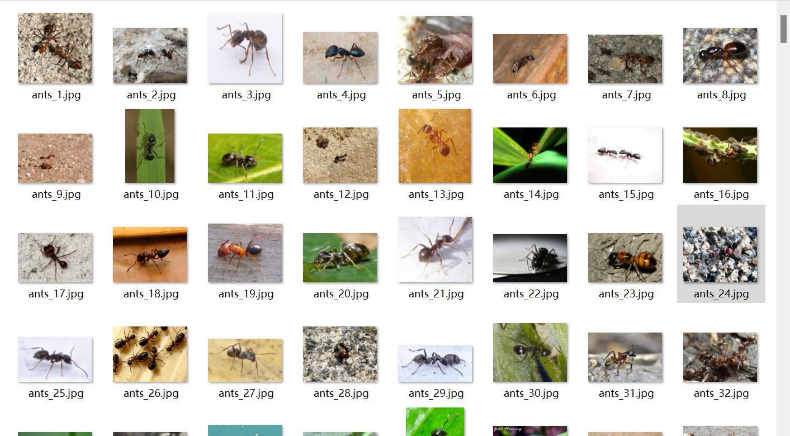

# Eleven Agricultural Harmful Pest Image Classification Dataset

**Complete Dataset Overview:**
- Number of images in the folder "ants": 498
- Number of images in the folder "bees": 500
- Number of images in the folder "beetle": 416
- Number of images in the folder "caterpillar": 433
- Number of images in the folder "earwig": 465
- Number of images in the folder "grasshopper": 484
- Number of images in the folder "moth": 496
- Number of images in the folder "slug": 389
- Number of images in the folder "snail": 499
- Number of images in the folder "wasp": 497
- Number of images in the folder "weevil": 485
Total number of images across all subfolders: 5162

**Overall Preview:**

Image

Here is a pay link on Stripe ( https://buy.stripe.com/3cs8yP7sY87d0vu9AB ). Please contact me lonlonago@foxmail.com after funding $89, and I will send you a complete data files , thank you!

